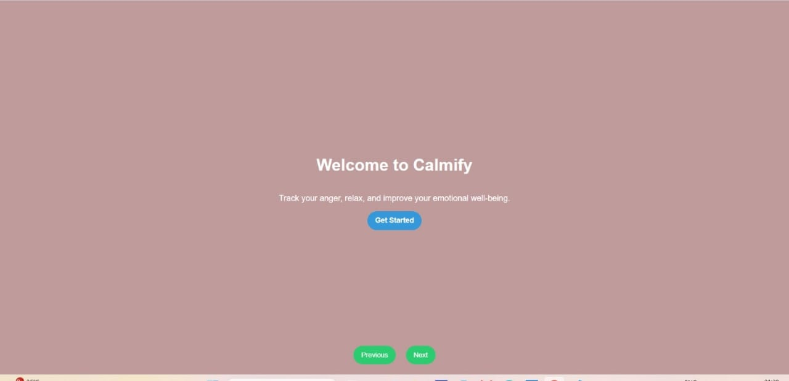
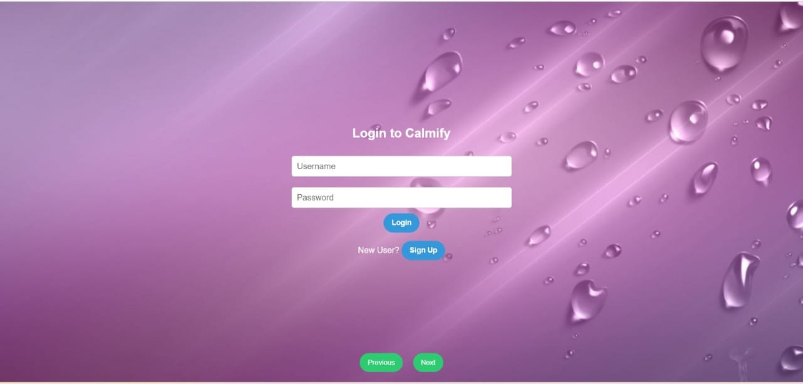
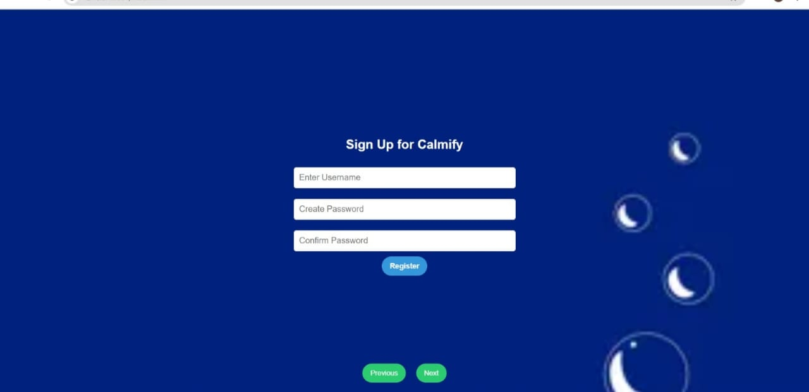
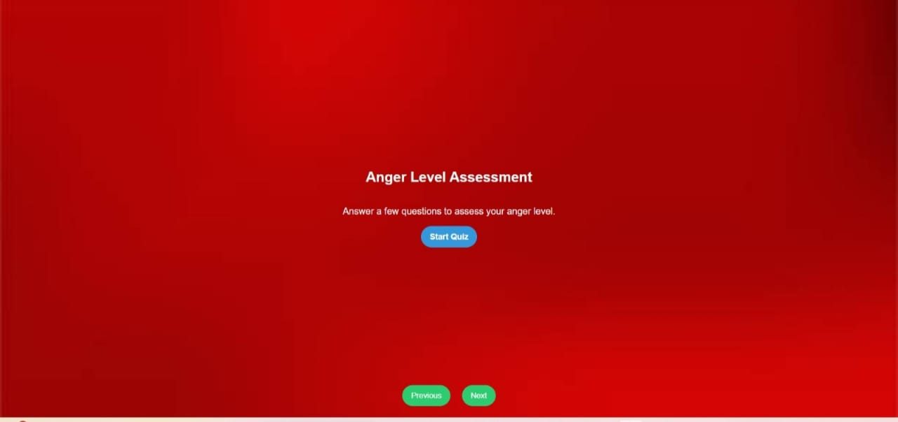
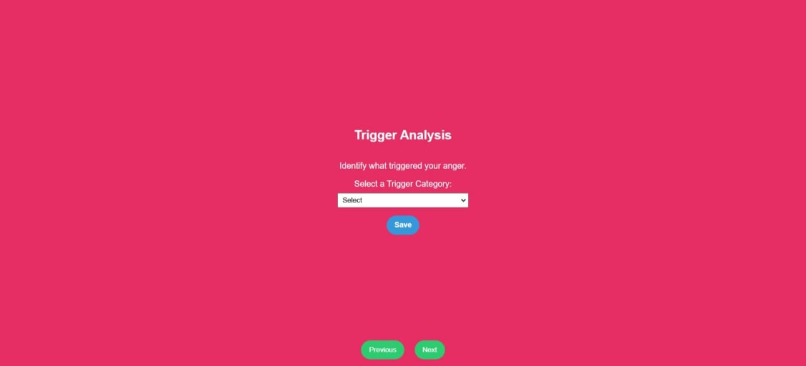
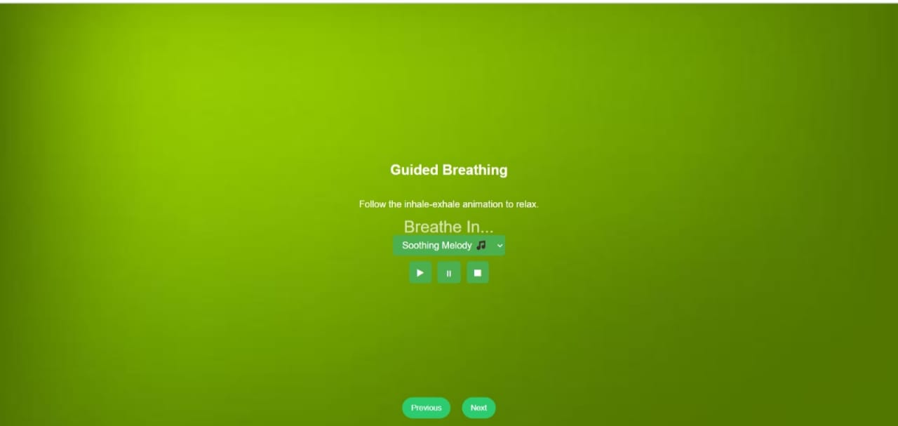
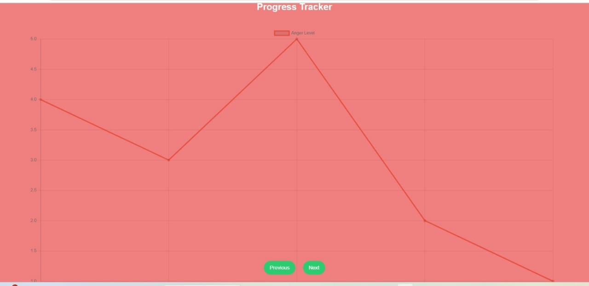
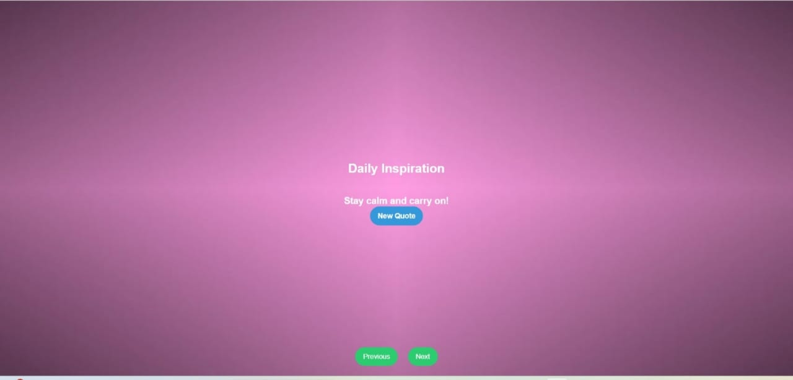

# Calmify - Anger Control Web App  

## Overview  
**Calmify** is a web application designed to help users track and manage their anger through interactive features such as anger level assessments, relaxation exercises, journaling, and progress tracking. The app provides a seamless and intuitive experience with a slide-based UI and finger touch capability.  

## Live Website  
   You can view the live demo of the Calmify-Anger-Control-Web-App here :
   
   **Live Website Link** : [Calmify Live Demo](https://jyothigodavarthi.github.io/Calmify-Anger-Control-App/)

## Tech Stack  
- **Frontend:** HTML, CSS, JavaScript  
- **Backend:** Node.js, Express.js  
- **Database:** Oracle SQL  
- **UI/UX:** Slide-based interface with touch support  

## Features  
- **📊 Anger Level Assessment Quiz** – Self-evaluation quiz to help users identify their anger levels.  
- **🧘 Relaxation Exercises** – Guided breathing and meditation techniques to reduce stress.  
- **📖 Anger Journaling** – A private space to write about anger episodes and reflect on emotions.  
- **📈 Progress Tracking** – Visual dashboard to monitor anger management improvements over time.  
- **🔐 User Authentication** – Secure login and registration for personalized experiences.  
- **📱 Responsive & Touch-Friendly UI** – Swipe-based navigation for seamless interaction.  

## Usage  

### 📊 Anger Level Assessment Quiz  
Users answer a series of questions to receive personalized feedback and coping strategies.  

### 🧘 Relaxation Exercises  
Step-by-step breathing and meditation exercises to help users calm down and control emotions.  

### 📖 Anger Journaling  
Users can write about their anger experiences, track patterns, and improve self-awareness.  

### 📈 Progress Tracking  
A dashboard that displays anger level trends, improvement graphs, and personal insights.   

### 🔐 User Authentication  
Allows users to create accounts, save progress, and access personalized content securely.    

### 📱 Responsive & Touch-Friendly UI  
Swipe through different sections with ease using finger gestures on mobile and tablets.  

## Screenshots  
### 🏠 Home Page  
  

### 🔐 Login Page  
  

### 📝 Signup Page  
  

### 📊 Anger Level Assessment  
  

### 🔍 Trigger Analysis Page  
  

### 📖 Anger Journal Page  
  

### 🧘 Guided Breathing Page  
  

### 📈 Progress Tracker Page  
  

### 📜 Daily Quote Page  
  

  

